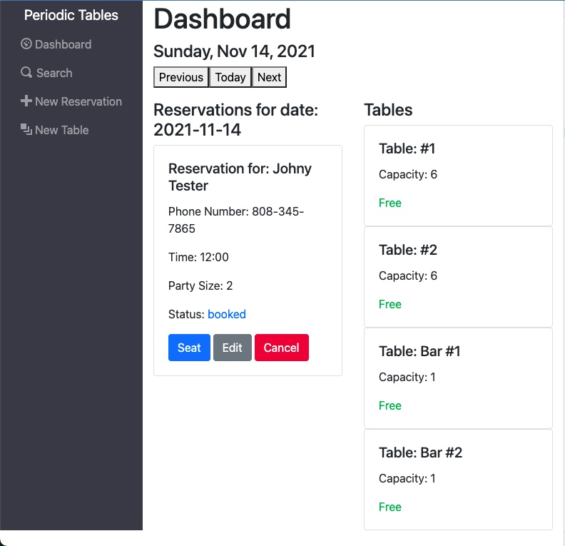
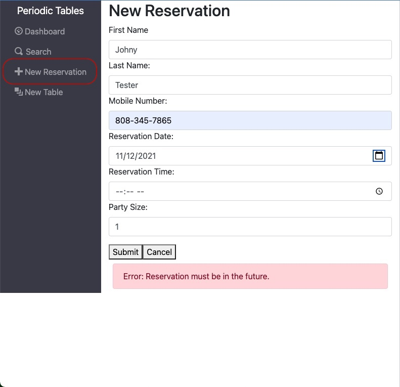
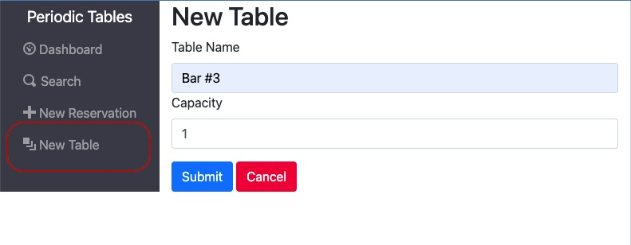
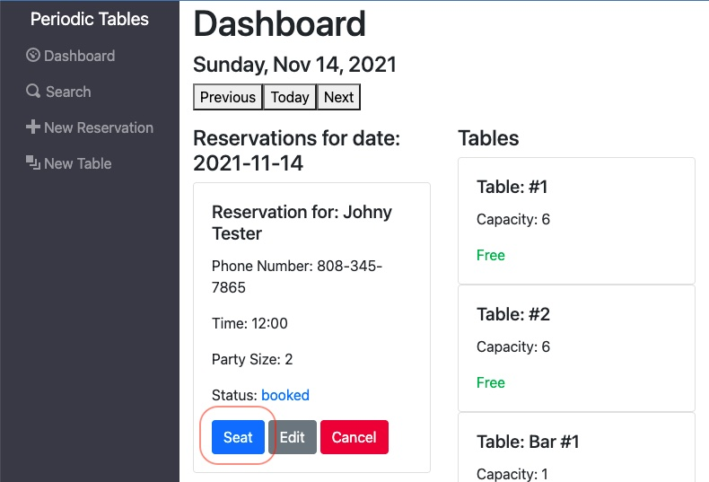
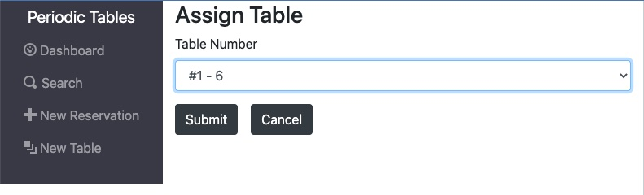
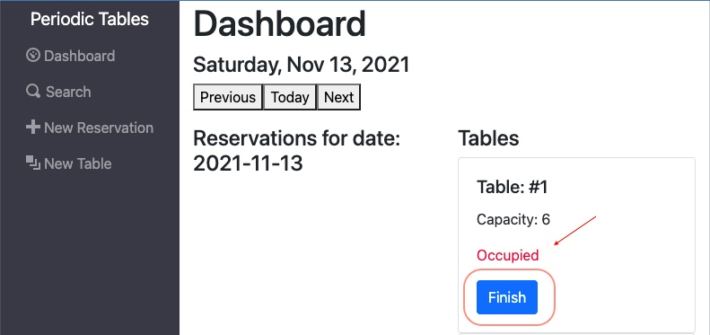
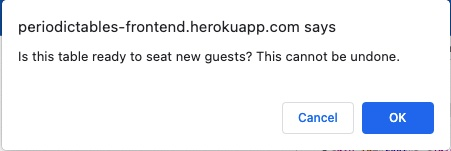
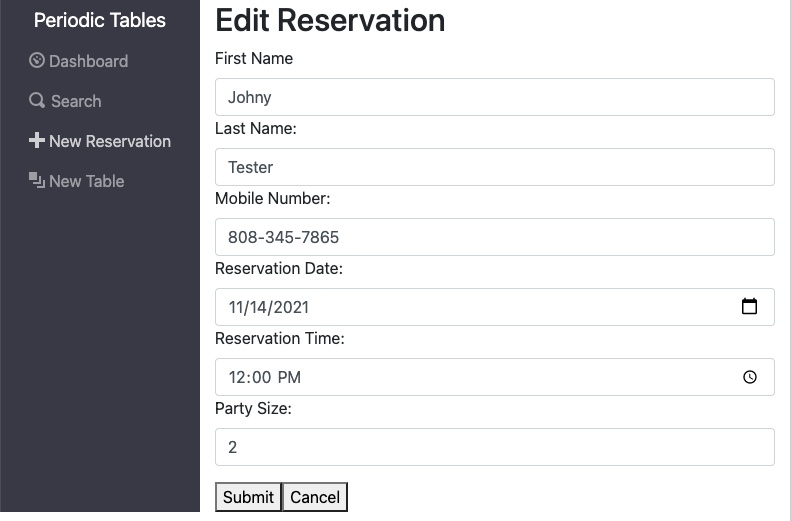
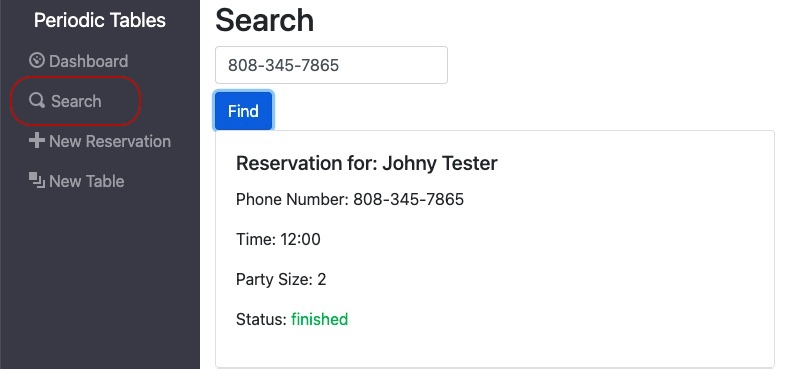

# Periodic Tables | Restaruant Reservation Dashboard

## Live App

[Restaurant Reservation System](https://periodictables-frontend.herokuapp.com/)

This is the capstone project for Thinkful's Software Engineering Bootcamp. Students were tasked with building a full stack web app based on the following prompt:

>You have been hired as a full stack developer at Periodic Tables, a startup that is creating a reservation system for fine dining restaurants. The software is used only by restaurant personnel when a customer calls to request a reservation. At this point, the customers will not access the system online.

## Tech Stack

*Front-end*
- React
- Bootstrap
- e2e tests

*Back-end*
- Node
- Express
- Knex
- PostgreSQL
- Jest

## User Stories

This app was developed according user stories provided by a ficticious restaurant manager.

- The app's dashboard displays all the booked reservations, defaulting to the current day. Date navigation buttons allow the user to view reservations in the future or in the past. The dashboard also displays each table with a current table-status (free or seated).

- The 'New Reservation' tab in the menu allows the user to create a new reservation with multiple validation handlers preventing the reservation from being booked in the past or during hours when the restaurant is not open. 
- Steps
    1. Fill out the form with the reservation information.
    2. Click `submit`.

- The 'New Table' tab in the menu allows the user to create a new instance of a table by assigning a table name and the maximum occupancy of the table.
- Steps
    1. Fill out the form with the table information.
    2. Click submit.

- On the dashboard, a reservation can be seated by clicking the 'seat' button on the reservation card. The user able to assign a table to the party from a dropdown menu. On the dashboard, the user will see the table is now 'occupied'. The user can unseat the table with the 'finish' button. A warning window will appear to confirm the choice to un-seat the table.
- Steps
    1. Click seat on the reservation you'd like to seat.
    2. Select a table from the drop-down menu.
    3. Click submit to seat the reservation at the selected table. 
    4. Click finish to un-seat the table.
    5. Confirm that you want to un-seat the table in the window.

- The user can edit a reservation's details by selecting the 'edit' button from the reservation card in the dashboard. They will be taken to an Edit screen where they can update and submit the new details of the reservation. 
- Steps
    1. Click edit on the reservation you'd like to edit.
    2. Edit any of the reservation information as needed.
    3. Click submit to save the updated reservation information.

- The 'Search' tab in the menu allows the user to seach  for a reservation using partial match of the phone number used to book the reservation.
- Steps
    1. Click search from the dashboard menu.
    2. Enter a partial or whole phone number into the field.
    3. Click find to display results.

## Back-end

API Base Url: https://periodictables-backend.herokuapp.com

| Endpoint | Description |
| - | - |
| `GET /reservations` | returns all reservations |
| `POST /reservations` | creates and returns a new reservation |
| `GET /reservations?date='YYYY-MM-DD'` | returns reservations by date (sorted asc) |
| `GET /reservations?mobile_number=123` | returns reservations by partial match of phone number |
| `GET /reservations/:reservationId` | returns reservation matching the reservationId |
| `PUT /reservations/:reservationId` | updates and returns the reservation matching the reservationId |
| `PUT /reservations/:reservationId/status` | updates only the status of a reservation |
| `GET /tables` | returns all Tables |
| `POST /tables` | creates and returns a new table |
| `PUT /tables:table_id/seat` | updates a table with a reservationId and changes status to "occupied" |
| `Delete /tables:table_id/seat` | updates a table by deleting reservationId and changes status to "free" |

## Installation

1. Fork and clone this repository.
1. Run `cp ./back-end/.env.sample ./back-end/.env`.
1. Update the `./back-end/.env` file with db connections. You can set some up for free with ElephantSQL database instances.
1. Run `cp ./front-end/.env.sample ./front-end/.env`.
1. You should not need to make changes to the `./front-end/.env` file unless you want to connect to a backend at a location other than `http://localhost:5000`.
1. Run `npm install` to install project dependencies.
1. Run `npm run start:dev` from the back-end directory to start your server in development mode.
1. Run `npm start` from the front-end directory to start the React app at http://localhost:3000.
